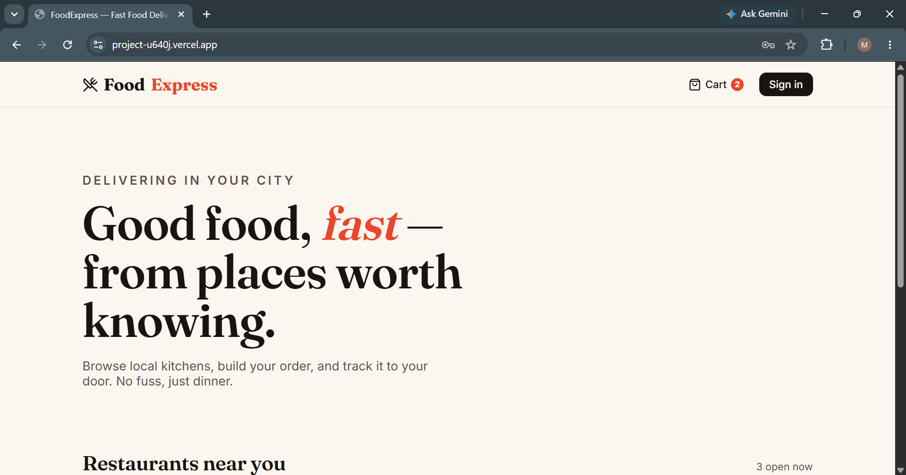
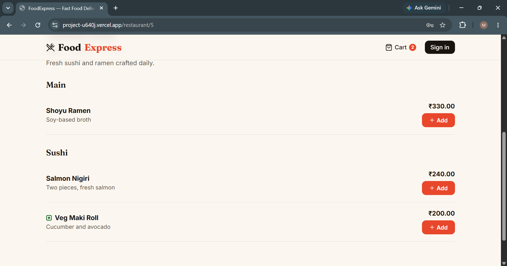
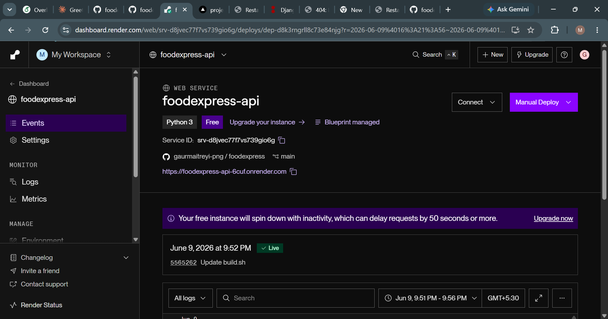
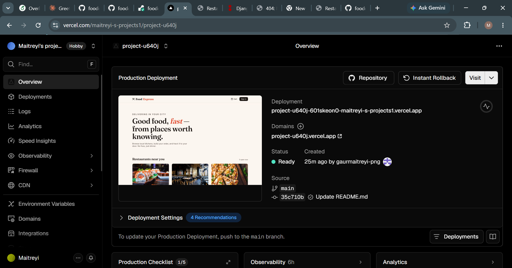

# FoodExpress 🍜

A full-stack food delivery web app. Browse restaurants, build an order, place it, track it. Built to learn the full pipeline end to end — Django schema design and object lifecycle on the backend, a typed React SPA on the frontend, and a real deployment across Render and Vercel.

**Live demo:** _add your Vercel link here_
**API:** _add your Render link here_



---

## What's inside

| Layer | Stack |
|-------|-------|
| Backend | Django 6 + Django REST Framework, JWT auth (SimpleJWT) |
| Database | PostgreSQL (SQLite for local dev) |
| Frontend | React 18 + TypeScript + Vite |
| UI / motion | Framer Motion, react-hot-toast, lucide-react icons |
| Hosting | Backend on Render, frontend on Vercel |

---

## Why these choices

I started down the MongoDB path because the brief named it, but Django's ORM is built for relational databases and a food-delivery domain is relational by nature — users own restaurants, restaurants have menu items, orders have line items. Forcing it through `djongo` would have fought the very thing the task asks you to learn (schemas and object lifecycle). PostgreSQL on Render's free tier was the faster, cleaner path and let the ORM do its job.

---

## The data model

Five models, each earning its place:

- **User** — a custom user model (subclassing `AbstractUser`). Set this up at project start; swapping it in later is painful.
- **Restaurant** — owned by a user, has a cuisine, rating, delivery time.
- **MenuItem** — belongs to a restaurant, has price and category.
- **Order** — placed by a customer against a restaurant, moves through a status lifecycle (`PENDING → CONFIRMED → PREPARING → OUT_FOR_DELIVERY → DELIVERED`, or `CANCELLED`).
- **OrderItem** — a line item. It *snapshots* the menu price at order time (`unit_price`), so later price changes never rewrite order history.


### Object lifecycle — the part worth understanding

Two deliberate lifecycle hooks:

1. **`OrderItem.save()`** sets `unit_price` from the linked menu item *if it isn't already set* — capturing the price at the moment of ordering.
2. **`Order.recalculate_total()`** sums its line items and saves only the changed fields (`update_fields=[...]`). The serializer calls this right after creating an order and its items, so the total is always derived, never trusted from the client.

This is the "object lifecycle" idea in practice: a model isn't just a row — it has behavior at create/save/update time, and `on_delete` rules (`CASCADE` vs `PROTECT`) decide what survives when related objects disappear. Orders use `PROTECT` on the restaurant so you can't delete a restaurant out from under a live order.

---

## API endpoints

| Method | Endpoint | Auth | Purpose |
|--------|----------|------|---------|
| POST | `/api/auth/register/` | – | Create account |
| POST | `/api/auth/login/` | – | Get JWT (`access`, `refresh`) |
| POST | `/api/auth/refresh/` | – | Refresh access token |
| GET | `/api/restaurants/` | – | List restaurants |
| GET | `/api/restaurants/{id}/` | – | Restaurant + nested menu |
| GET | `/api/orders/` | ✓ | Current user's orders |
| POST | `/api/orders/` | ✓ | Place an order |
| POST | `/api/orders/{id}/cancel/` | ✓ | Cancel an order |

The frontend routes map onto these one-to-one — `/` calls the restaurant list, `/restaurant/:id` calls the detail endpoint, `/cart` posts an order, and so on.

---

## Run it locally

### Backend

```bash
cd backend
python -m venv venv
venv\Scripts\activate        # Windows
pip install -r requirements.txt
python manage.py migrate
python seed.py               # loads 3 demo restaurants
python manage.py runserver
```

API is now at `http://localhost:8000`.

### Frontend

```bash
cd frontend
npm install
npm run dev
```

App is now at `http://localhost:5173`. The `.env` file points `VITE_API_URL` at your local backend.



---

## Deployment

### Backend → Render

1. Push this repo to GitHub.
2. On Render: **New → Blueprint**, point it at the repo. `render.yaml` provisions the web service *and* a free Postgres database automatically.
3. After the first deploy, set `CORS_ALLOWED_ORIGINS` to your Vercel URL.



### Frontend → Vercel

1. On Vercel: **New Project**, import the repo, set the root directory to `frontend`.
2. Add an environment variable: `VITE_API_URL = https://your-app.onrender.com/api`
3. Deploy. `vercel.json` handles SPA routing so refreshing a deep link doesn't 404.



---

## What I'd add next

- Restaurant-owner dashboard (the `is_restaurant_owner` flag is already there)
- Real payment flow
- Order status updates over websockets
- Search and cuisine filtering

---

## Notes

The demo seed data uses Unsplash images. Auth tokens live in `localStorage` — fine for a demo, but a production build would move to httpOnly cookies.
